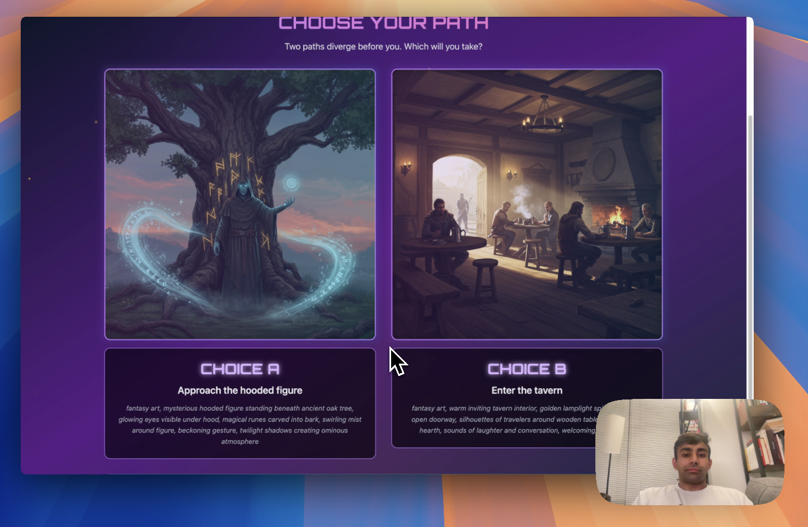

# 🎮 Adventure Agent

> **A fun Choose Your Own Adventure Game played with your voice and eyes!  Transform your voice into epic adventures with AI-powered storytelling and real-time image generation**

[](https://opensource.org/licenses/MIT)
[](https://reactjs.org/)
[](https://fastapi.tiangolo.com/)
[](https://vapi.ai/)
[](https://cloud.google.com/vertex-ai/generative-ai/docs/image/overview)


## 🌟 What Makes This Special?

Imagine stepping into a world where **your voice becomes the controller** and **AI becomes your dungeon master**. Voice Adventure Agent is a fun Choose Your Own Adventure storytelling experience that combines:

- 🗣️ **Natural Voice Interaction** - Speak your choices, describe your actions, shape your destiny
- 🎨 **Real-time AI Art Generation** - Watch your story unfold through stunning visuals created by Google's Imagen-3
- 🎭 **Dynamic Storytelling** - Every adventure is unique, limited only by your imagination
- ⚡ **Realtime Response** - Seamless conversation flow with your AI guide
- 🌍 **Infinite Possibilities** - Medieval quests, space adventures, mystery investigations—you choose!

## 🎯 Why This Project Exists

Traditional games lock you into predetermined paths. Voice Adventure Agent breaks those chains by creating a **truly interactive narrative experience** where:

- **Your voice drives the story** - No clicking, no typing, just natural conversation
- **Every choice matters** - The AI remembers your decisions and weaves them into the narrative
- **Visual storytelling** - Each scene comes alive with custom-generated artwork
- **Accessibility first** - Perfect for visually impaired users or anyone who prefers voice interaction
- **Creative expression** - Describe wild scenarios and watch the AI bring them to life

## 🚀 Live Demo
[](https://www.youtube.com/watch?v=psj5oVVWmvA "Adventure Agent Demo")

## 🛠️ Tech Stack Deep Dive

### 🎤 Voice AI Layer
- **[Vapi.ai](https://vapi.ai/)** - Advanced voice agent platform
  - Real-time speech-to-text with conversation context
  - Natural language understanding and response generation
  - Function calling capabilities for seamless tool integration
  - Customizable voice personalities and response patterns

### 🎨 AI Image Generation
- **[Google Imagen-3](https://cloud.google.com/vertex-ai/generative-ai/docs/image/overview)** - State-of-the-art image synthesis
  - Photorealistic scene generation from text descriptions
  - Consistent art style across adventure sequences
  - Fast generation times (2-4 seconds per image)
  - High-resolution outputs optimized for web display

### 🖥️ Frontend Architecture
- **[React 18.3.1](https://reactjs.org/)** with modern hooks and concurrent features
- **[Vite](https://vitejs.dev/)** for lightning-fast development and optimized builds
- **[Tailwind CSS](https://tailwindcss.com/)** for responsive, utility-first styling
- **[Vapi Web SDK](https://docs.vapi.ai/web-sdk)** for seamless voice integration
- **Real-time state management** with React hooks and refs for immediate UI updates

### ⚡ Backend Infrastructure
- **[FastAPI](https://fastapi.tiangolo.com/)** - High-performance async Python framework
- **[Pydantic](https://pydantic.dev/)** for robust data validation and serialization
- **[Google Cloud AI](https://cloud.google.com/ai)** integration for image generation
- **RESTful API design** with comprehensive error handling
- **CORS-enabled** for secure cross-origin requests

### 🔧 Development & Deployment
- **Environment-based configuration** for secure API key management
- **Modular architecture** with clear separation of concerns
- **Comprehensive error handling** and user feedback
- **Production-ready** with proper logging and monitoring hooks

## 🎮 How It Works

### The Magic Behind the Scenes

1. **Voice Capture** 📢
   - Vapi captures your voice in real-time
   - Advanced speech-to-text converts your words to actionable commands
   - Context awareness maintains conversation flow

2. **AI Processing** 🧠
   - Your voice input triggers specific function calls
   - The AI agent decides when to generate scenes vs. present choices
   - Natural language processing ensures smooth conversation

3. **Image Generation** 🎨
   - Scene descriptions are sent to Google Imagen-3
   - AI creates stunning visuals in 2-4 seconds
   - Images are optimized and served through the backend

4. **Dynamic UI Updates** ✨
   - React frontend updates in real-time
   - Smooth transitions between scenes and choices
   - Visual feedback during generation processes

### Two-Phase Adventure Flow

**Phase 1: Scene Setting** 🌅
- AI generates atmospheric scene images
- Large, immersive visuals set the mood
- Detailed descriptions paint the world

**Phase 2: Choice Presentation** 🔀
- Two distinct path options appear
- Side-by-side choice images show possibilities
- Voice selection drives the next scene

## 📋 Prerequisites

Before you begin, ensure you have:

- **Node.js 18+** and **npm** installed
- **Python 3.11+** with **pip**
- **Git** for cloning the repository
- **Google Cloud Account** with Vertex AI API access
- **Vapi.ai Account** for voice agent services

## 🚀 Quick Start Guide

### 1. Clone & Setup

```bash
# Clone the repository
git clone https://github.com/yourusername/voice-adventure-agent.git
cd voice-adventure-agent

# Run the automated setup script
chmod +x setup.sh
./setup.sh
```

The setup script will:
- Create Python virtual environment
- Install all dependencies (backend & frontend)
- Generate environment template files
- Provide next steps for API configuration

### 2. Get Your API Keys

#### Google Cloud (Imagen-3) Setup
1. Go to [Google Cloud Console](https://console.cloud.google.com/)
2. Create a new project or select existing one
3. Enable the **Vertex AI API**
4. Create a service account with Vertex AI permissions
5. Download the JSON key file
6. Set environment variable: `export GOOGLE_APPLICATION_CREDENTIALS="/path/to/your/keyfile.json"`
7. Get your project ID from the console

#### Vapi.ai Setup
1. Sign up at [Vapi.ai](https://vapi.ai/)
2. Create a new assistant in the dashboard
3. Configure the assistant with these tools:

**Tool 1: generate_scene**
```json
{
  "name": "generate_scene",
  "description": "Generate a single atmospheric scene image",
  "parameters": {
    "type": "object",
    "properties": {
      "scene_prompt": {
        "type": "string",
        "description": "Detailed description of the scene to generate"
      }
    },
    "required": ["scene_prompt"]
  }
}
```

**Tool 2: generate_choices**
```json
{
  "name": "generate_choices",
  "description": "Generate two choice option images",
  "parameters": {
    "type": "object",
    "properties": {
      "choice_a_prompt": {
        "type": "string",
        "description": "Image prompt for choice A"
      },
      "choice_b_prompt": {
        "type": "string",
        "description": "Image prompt for choice B"
      },
      "choice_a_text": {
        "type": "string",
        "description": "Text description for choice A"
      },
      "choice_b_text": {
        "type": "string",
        "description": "Text description for choice B"
      }
    },
    "required": ["choice_a_prompt", "choice_b_prompt", "choice_a_text", "choice_b_text"]
  }
}
```

4. Copy your **Public Key** and **Assistant ID**

### 3. Configure Environment Variables

#### Backend Configuration (`backend/.env`)
```bash
# Copy from template
cp backend/env_template.txt backend/.env

# Edit backend/.env and add:
GEMINI_API_KEY=your_google_cloud_project_id
```

#### Frontend Configuration (`frontend/.env`)
```bash
# Copy from template
cp frontend/env_template.txt frontend/.env

# Edit frontend/.env and add:
VITE_VAPI_PUBLIC_KEY=your_vapi_public_key
VITE_ASSISTANT_ID=your_vapi_assistant_id
VITE_BACKEND_URL=http://localhost:8000
```

### 4. Launch the Adventure

```bash
# Terminal 1: Start the backend
cd backend
source .venv/bin/activate  # On Windows: .venv\Scripts\activate
uvicorn main:app --reload --host 0.0.0.0 --port 8000

# Terminal 2: Start the frontend
cd frontend
npm run dev
```

🎉 **Open http://localhost:5173 and start your adventure!**

## 🎯 Usage Guide

### Starting Your First Adventure

1. **Click "BEGIN ADVENTURE"** - This connects you to your AI guide
2. **Describe your desired adventure** - "I want to explore a haunted castle" or "Take me on a space mission"
3. **Watch the scene generate** - Your AI guide creates a visual representation
4. **Make choices by speaking** - "I choose the left path" or "Choice A"
5. **Continue the story** - Each choice leads to new scenes and possibilities

### Pro Tips for Better Adventures

- **Be descriptive** - "I want to sneak through the shadows" vs. "I go left"
- **Ask for choices** - "What are my options?" if you want the AI to present paths
- **Set the mood** - "Make it spooky" or "I want something lighthearted"
- **Reference the images** - "I want to investigate that glowing object in the scene"

### Voice Commands That Work Well

- **Navigation**: "Go north", "Enter the building", "Climb the mountain"
- **Actions**: "Search the room", "Talk to the character", "Use my sword"
- **Choices**: "Choice A", "The left path", "I choose to fight"
- **Requests**: "Show me my options", "What can I do here?", "Describe the scene"

## 🔧 Development

### Project Structure

```
voice-adventure-agent/
├── backend/                 # FastAPI server
│   ├── main.py             # Main application with all endpoints
│   ├── requirements.txt    # Python dependencies
│   ├── env_template.txt    # Environment template
│   └── static/            # Generated images (auto-created)
├── frontend/               # React application
│   ├── src/
│   │   └── App.jsx        # Main React component
│   ├── public/
│   │   └── welcome.png    # Welcome screen image
│   ├── package.json       # Node.js dependencies
│   └── env_template.txt   # Environment template
├── setup.sh               # Automated setup script
└── README.md              # This file
```

### API Endpoints

#### Backend Endpoints
- `POST /api/generate_scene` - Generate single scene image
- `POST /api/generate_choices` - Generate choice option images
- `POST /vapi/generate_scene` - Vapi-compatible scene endpoint
- `POST /vapi/generate_choices` - Vapi-compatible choices endpoint
- `GET /static/{filename}` - Serve generated images

#### Request/Response Examples

**Generate Scene:**
```json
// Request
{
  "scene_prompt": "A mystical forest clearing with ancient stone ruins"
}

// Response
{
  "sceneURL": "/static/scene_1234567890.png"
}
```

**Generate Choices:**
```json
// Request
{
  "choice_a_prompt": "A dark cave entrance",
  "choice_b_prompt": "A bright mountain path",
  "choice_a_text": "Enter the mysterious cave",
  "choice_b_text": "Take the mountain trail"
}

// Response
{
  "choices": [
    {
      "label": "A",
      "text": "Enter the mysterious cave",
      "url": "/static/choice_a_1234567890.png"
    },
    {
      "label": "B", 
      "text": "Take the mountain trail",
      "url": "/static/choice_b_1234567890.png"
    }
  ]
}
```

### Adding New Features

The modular architecture makes it easy to extend:

- **New AI Models**: Update the image generation logic in `main.py`
- **Additional Tools**: Add new Vapi function calls and corresponding endpoints
- **UI Enhancements**: Modify the React components in `App.jsx`
- **Voice Customization**: Configure different voice personalities in Vapi dashboard

## 🐛 Troubleshooting

### Common Issues

**"Missing Vapi configuration" Error**
- Verify your `frontend/.env` file has correct Vapi credentials
- Check that `VITE_VAPI_PUBLIC_KEY` and `VITE_ASSISTANT_ID` are set

**Images Not Generating**
- Ensure Google Cloud credentials are properly configured
- Verify Vertex AI API is enabled in your Google Cloud project
- Check backend logs for specific error messages

**Voice Not Working**
- Ensure microphone permissions are granted in your browser
- Check that you're using HTTPS (required for microphone access)
- Verify Vapi assistant is properly configured with the required tools

**Backend Connection Issues**
- Confirm backend is running on port 8000
- Check `VITE_BACKEND_URL` in frontend `.env` matches backend address
- Verify CORS settings if accessing from different domains

### Debug Mode

Enable detailed logging by setting environment variables:

```bash
# Backend debugging
export LOG_LEVEL=DEBUG

# Frontend debugging (check browser console)
# Detailed logs are already enabled in development mode
```

## 🤝 Contributing

We welcome contributions! Here's how to get started:

1. **Fork the repository**
2. **Create a feature branch**: `git checkout -b feature/amazing-feature`
3. **Make your changes** with clear, commented code
4. **Add tests** if applicable
5. **Commit your changes**: `git commit -m 'Add amazing feature'`
6. **Push to the branch**: `git push origin feature/amazing-feature`
7. **Open a Pull Request** with a detailed description

### Development Guidelines

- Follow existing code style and patterns
- Add comments for complex logic
- Update documentation for new features
- Test thoroughly before submitting
- Keep commits focused and atomic

## 📄 License

This project is licensed under the MIT License - see the [LICENSE](LICENSE) file for details.

## 🙏 Acknowledgments

- **[Vapi.ai](https://vapi.ai/)** for providing the incredible voice AI platform
- **[Google Cloud](https://cloud.google.com/)** for Imagen-3 image generation capabilities
- **[React](https://reactjs.org/)** and **[FastAPI](https://fastapi.tiangolo.com/)** communities for excellent frameworks
- **Open source community** for inspiration and tools

## 🌟 Star History

If this project helped you or inspired you, please consider giving it a star! ⭐


**Ready to embark on your voice-powered adventure?** 🚀

[⭐ Star this repo](https://github.com/yourusername/voice-adventure-agent) | [🐛 Report Bug](https://github.com/yourusername/voice-adventure-agent/issues) | [💡 Request Feature](https://github.com/yourusername/voice-adventure-agent/issues) 